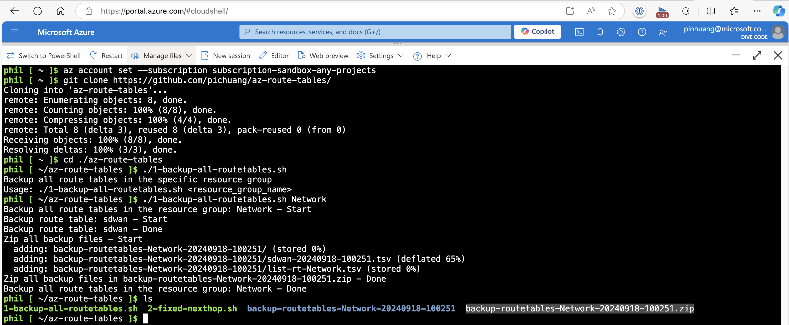
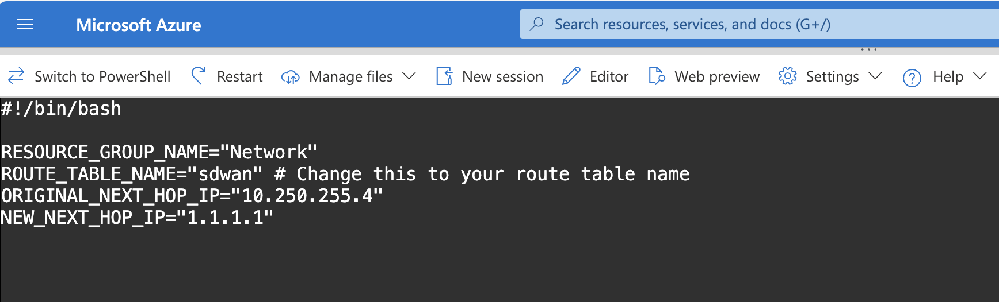

# Azure Route Table Script

## 1-backup-all-routetables.sh



1. [Open Azure Shell](https://shell.azure.com/)
2. Download the script

```bash
az account set --subscription subscription-sandbox-any-projects
git clone https://github.com/pichuang/az-route-tables/
cd ./az-route-tables
./1-backup-all-routetables.sh Network
```

## 2-fixed-nexthop.sh



1. [Open Azure Shell](https://shell.azure.com/)
2. Download the script

```bash
az account set --subscription subscription-sandbox-any-projects
git clone https://github.com/pichuang/az-route-tables/
cd ./az-route-tables
./2-fixed-nexthop.sh Test_sdwan
```

